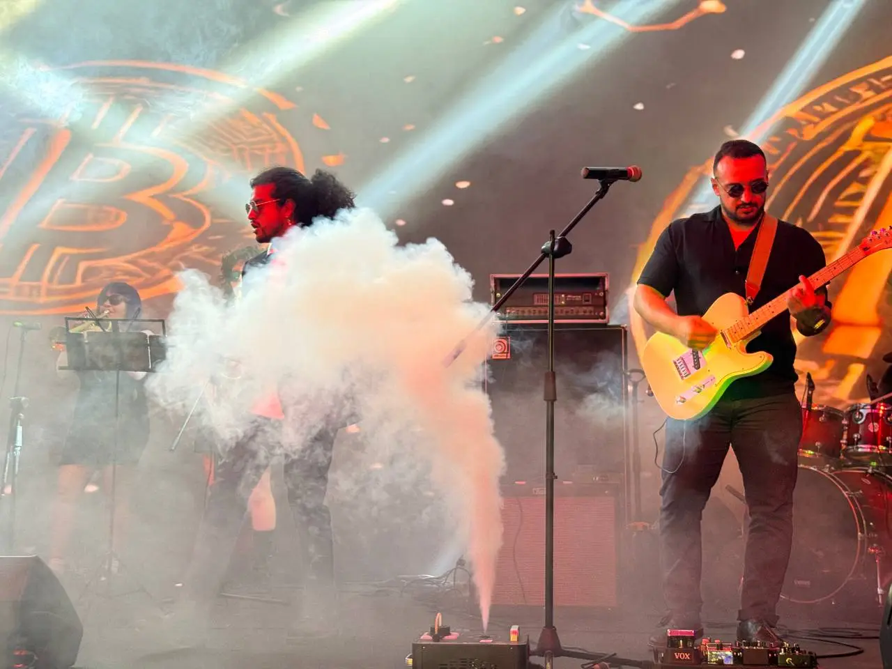

# ⚡ Lightning Smoke Machine

→ Trigger a smoke machine with a Bitcoin Lightning payment built with an ESP32, BTCPay Server + Blink, and BitcoinSwitch.

*⚡ Real test on the main stage at Plan ₿ Forum, San Salvador 2025*

- **Level:** Intermediate
- **Estimated time:** 2-3 hours
- **Use cases:** Bitcoin events, artistic performances, Lightning demos, automated stage effects

## Tutorial

| Language | Link |
|---|---|
| 🇫🇷 Français | [docs/fr/tutorial.md](./docs/fr/tutorial.md) |
| 🇺🇸 English | [docs/en/tutorial.md](./docs/en/tutorial.md) |
| 🌍 28 languages | [Plan B Academy](https://planb.academy/fr/tutorials/business/others/lightning-smoke-machine-1a14c9e2-764f-4cbc-ab57-cf6c217a317d) |

## Interactive Tutorial App

Follow the tutorial step by step directly on your phone:

👉 **[smoke-machine.ezmo.dev](https://smoke-machine.ezmo.dev)**

No installation required. Available in English and French. Your progress is saved in your browser.

## How it works

1. A Lightning invoice is displayed on screen
2. The payment is detected by BTCPay Server + Blink
3. A WebSocket triggers the ESP32 via BitcoinSwitch
4. The ESP32 activates a relay connected to the smoke machine

## Hardware

**Electronic components**
- ESP32-WROOM-32 microcontroller
- 5V relay module with optocoupler
- 220V fog machine with 12V battery remote control
- Dupont cables: Male/Male and Male/Female
- 5V USB power supply or Li-Po battery
- Micro-USB cable
- Smoke machine liquid

**Tools**
- Soldering iron + tin (or Dupont connectors)
- Screwdriver
- Multimeter (recommended)

## Built with

- [BitcoinSwitch](https://bitcoinswitch.lnbits.com/) — ESP32 firmware flasher by [@arcbtc](https://github.com/arcbtc) & [@dni](https://github.com/dni)
- [BTCPay Server](https://btcpayserver.org/)
- [Blink](https://blink.sv/)
- Chrome / Edge / Brave (WebSerial required for flashing)

## ⚠️ Safety

This project involves a **220V mains supply** and a **12V battery remote control**.
Always disconnect the smoke machine from the mains **and** remove the battery from the remote control before opening it or handling the wiring.
Read the full safety section in the [tutorial](./docs/en/tutorial.md) before starting.

## License

MIT © 2026 Ezmo
